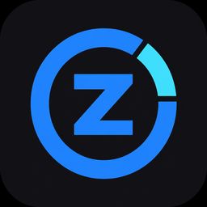

<p align="center"></p>
<h1 align="center">ZGSTokenBar</h1>

ZGSTokenBar is an open-source, local-first Windows taskbar companion for monitoring AI usage and system metrics. The compact Mini can dock to a taskbar or float on the desktop.

## Highlights

- Built-in Claude and Codex quota providers, local Codex token summaries, and system metrics.
- Multiple Codex accounts are grouped with Pro accounts before Plus accounts, then sorted by remaining quota within each plan.
- Independent, reorderable and resizable Mini areas with quota details and reset countdowns.
- Optional start-at-login and keep-running supervision. When keep-running is enabled, a watchdog restarts the app after an unexpected exit until the option is disabled.
- Typed Provider SDK, strict manifests, generated built-in registry, and isolated process-plugin support.
- Local named-pipe control API and a NativeAOT command-line client.
- No telemetry or cloud sync.

## Use

Drag the Mini's card area to reposition it along the taskbar or pull it onto the desktop. Hover a real Mini quota capsule to see its exact reset time, live countdown, freshness, and usage details; click to pin the popover. Click outside or press Escape to close it. To open the optional Radar view, hover a Codex logo in Mini when that public data source is enabled.

## Requirements

- Windows 10 or later, x64.
- .NET SDK 10 and Node.js 24 only when building from source.

## Build and verify

```powershell
npm ci
npm run verify
npm run dist
```

`npm run verify` is the complete non-interactive graduation gate. `npm run dist` creates the portable application and CLI artifacts under `release/`.

## CLI

```powershell
ZGSTokenBar.Cli.exe settings
ZGSTokenBar.Cli.exe status --json
ZGSTokenBar.Cli.exe plugin list
ZGSTokenBar.Cli.exe mini collapse zgstokenbar.provider.codex
ZGSTokenBar.Cli.exe mini width zgstokenbar.provider.codex 180
ZGSTokenBar.Cli.exe window inspect
```

See [Provider development](docs/providers.md), [development](docs/development.md), and [privacy and security](docs/privacy-security.md).

## License

MIT. See [LICENSE](LICENSE).
